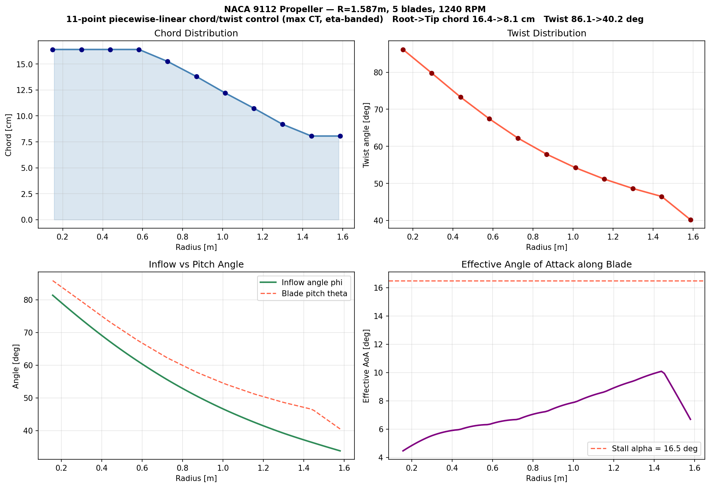

# AAE3001 — Propeller Aerodynamic Design

This repository contains the code for an AAE3001 propeller-design project based on Blade Element Momentum Theory (BEMT), NeuralFoil airfoil analysis, and a follow-on OpenFOAM MRF verification workflow.

## Repository Contents

| File | Purpose |
|---|---|
| `bem_validation_script.py` | Baseline BEM validation against reference propeller data |
| `naca_sweep_phase1.py` | Sweep of valid NACA 4-digit airfoils using NeuralFoil |
| `propeller_design.py` | Optimise spanwise chord/twist for maximum `CT` |
| `propeller_design_eta.py` | Optimise spanwise chord/twist for maximum propeller efficiency `eta` |
| `propeller_design_ct_eta.py` | Maximise `CT` subject to an efficiency band constraint |
| `gmsh_propeller_mrf.py` | Generate 3D propeller geometry and an OpenFOAM MRF mesh in Gmsh |

## Workflow

1. Validate the BEM implementation against standard propeller data.
2. Sweep 656 valid NACA 4-digit sections and select the best blade airfoil.
3. Optimise the propeller geometry for a Supermarine Spitfire Mk 24 design point.
4. Export a 3D blade and CFD domain mesh for OpenFOAM MRF verification.

## Requirements

Base Python workflow:

```bash
pip install numpy scipy neuralfoil aerosandbox pandas matplotlib
```

Optional CFD/mesh generation:

```bash
pip install gmsh
```

If `gmsh` fails to load on Apple Silicon because of an architecture mismatch, use an arm64 Python interpreter for the mesh-generation script.

## Usage

**1. BEM validation**

```bash
python3 bem_validation_script.py
```

This compares computed `CT` against reference data for a standard rectangular propeller and reports the error.

**2. NACA airfoil sweep**

```bash
python3 naca_sweep_phase1.py
```

This evaluates 656 valid NACA 4-digit airfoils across the project cruise-speed envelope and selects the best blade section.

**3. Maximum-`CT` propeller optimisation**

```bash
python3 propeller_design.py
```

This uses BEM + NeuralFoil to optimise a piecewise-linear chord/twist distribution for maximum thrust coefficient. Output figure: `propeller_design.png`

**4. Maximum-efficiency propeller optimisation**

```bash
python3 propeller_design_eta.py
```

This keeps the same aerodynamic model but changes the objective to maximum propeller efficiency `eta`. Output figure: `propeller_design_eta.png`

**5. Constrained `CT` optimisation within an efficiency band**

```bash
python3 propeller_design_ct_eta.py
```

This maximises `CT` while enforcing an efficiency constraint. The current script uses an 11-point piecewise-linear geometry parameterisation and a default efficiency band of `0.92 <= eta <= 0.95`. 
Output figure: `propeller_design_ct_eta.png`

**6. Gmsh mesh generation for OpenFOAM MRF**

```bash
arch -arm64 /Library/Frameworks/Python.framework/Versions/3.13/bin/python3 gmsh_propeller_mrf.py --design ct --output-dir gmsh_output_vm
```

The mesh script writes:

- `propeller_solid.step`
- `propeller_mrf_domain.msh`

It creates these physical groups for OpenFOAM:

- `propeller`
- `inlet`
- `outlet`
- `outerWall`
- `rotatingZone`
- `stationaryZone`

The current defaults are tuned for a coarse 8 GB VM-scale OpenFOAM test mesh and write Gmsh `2.2` format for `gmshToFoam`.

## BEM Validation

The BEM implementation is validated against reference experimental data for a standard 3-blade rectangular propeller (`R = 1.829 m`, `c = 0.1524 m`, `600 RPM`, `NACA 0012`).

| Twist angle | `CT` computed | `CT` reference | Error |
|---|---:|---:|---:|
| `1°` | `0.00019` | `0.00017` | `+9.7%` |
| `8°` | `0.00498` | `0.00442` | `+12.7%` |
| `15°` | `0.01162` | `0.01078` | `+7.7%` |

The code systematically over-predicts thrust because the basic validation model neglects profile drag and does not apply a 3D tip-loss correction.

## Airfoil Selection

The report evaluates 656 valid NACA 4-digit airfoils over:

- altitude: `10,000 ft`
- speed range: `200–300 kts`
- Mach range: `0.313–0.470`
- Reynolds number: about `11.0M–16.5M`

Selected blade section:

- `NACA 9112`
- mean `CL_max = 2.684`

This high-lift result comes from an aggressively cambered section, which is useful for the propeller study but would be a questionable choice for a conventional wing because of the associated pitching-moment penalty.

## Propeller Design Point

The optimisation phase uses a 5-blade propeller based on a Supermarine Spitfire Mk 24 reference condition:

| Parameter | Value |
|---|---|
| Radius `R` | `1.587 m` |
| Hub radius `R_root` | `0.150 m` |
| Blade count | `5` |
| RPM | `1240` |
| Design speed | `250 kts` |
| Altitude | `10,000 ft` |

All optimisation scripts use BEM with drag, NeuralFoil polar data for `NACA 9112`, and Prandtl-Glauert correction for compressibility.

## Optimisation Results

### Maximum `CT`

At the `250 kts` design point:

- `CT = 0.14302`
- `CQ = 0.10530`
- `eta = 0.848`
- thrust `= 43,474 N`
- shaft power `= 6,596 kW`

This gives the highest thrust coefficient, but the power demand is far beyond the real engine capability.


### Maximum `eta`

At the `250 kts` design point:

- `CT = 0.01366`
- `CQ = 0.00883`
- `eta = 0.965`
- thrust `= 4,151 N`
- shaft power `= 553 kW`

This produces a very efficient but lightly loaded propeller.


### Maximum `CT` with efficiency constraint

The constrained script increases the geometry freedom to an 11-point piecewise-linear chord/twist parameterisation and enforces an efficiency band.

At the `250 kts` design point:

- `CT = 0.05604`
- `CQ = 0.03801`
- `eta = 0.920`
- thrust `= 17,033 N`
- shaft power `= 2,381 kW`

This mode captures the main `CT`–`eta` tradeoff described in the report and is the most practical of the three current optimisation modes.



## CFD / OpenFOAM Verification

The report includes a first OpenFOAM 11 verification using a steady-state Multiple Reference Frame (MRF) model.

Key points from the report:

- the final CFD setup was run on a Linux VM
- a very fine tetra mesh was too large to run locally
- a smaller mesh was used for the first verification
- the pre-divergence CFD result gave approximately `CT = 0.098–0.120`
- the corresponding thrust range was about `35–36 kN` before instability

This CFD result does not yet cleanly converge and should be treated as a first-order check, not a final validation. The report attributes the gap between CFD and BEMT to a combination of BEMT simplifications, mesh quality limitations, and the absence of a high-quality boundary-layer mesh.


