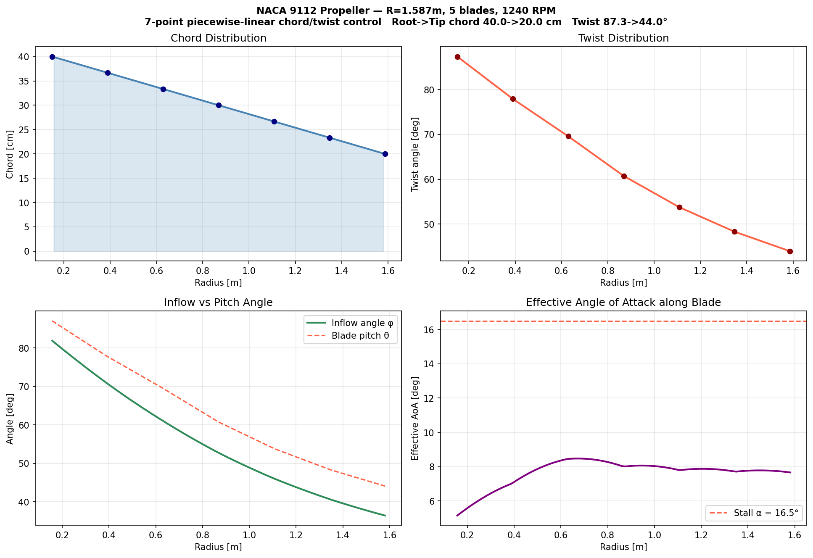
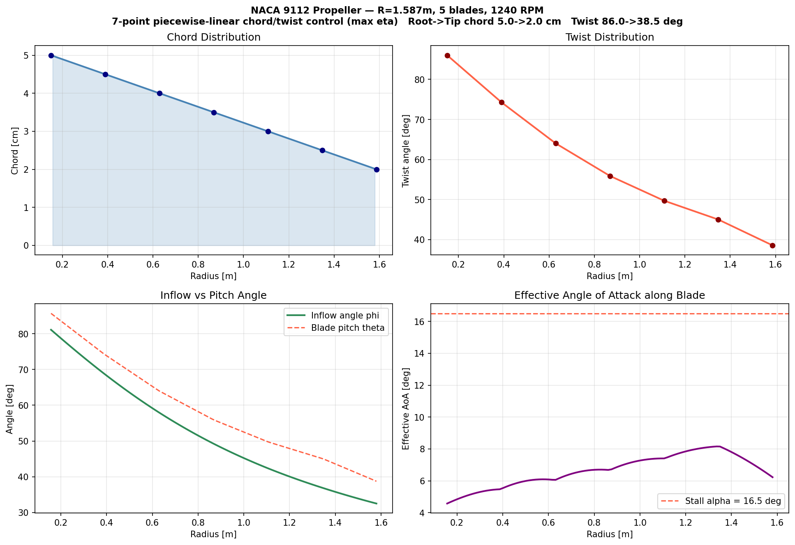

# AAE3001 — Propeller Aerodynamic Design

A student project on propeller design using Blade Element Momentum Theory (BEMT) and NeuralFoil airfoil analysis.

## Overview

| Script | Purpose |
|---|---|
| `bem_validation_script.py` | BEM propeller validation + C_T optimisation |
| `naca_sweep_phase1.py` | NACA 4-digit sweep to select best blade section airfoil |
| `propeller_design.py` | Piecewise-linear chord/twist optimisation for maximum `C_T` |
| `propeller_design_eta.py` | Piecewise-linear chord/twist optimisation for maximum efficiency `eta` |

## Requirements

```
numpy scipy neuralfoil aerosandbox pandas matplotlib
```

Install with:

```bash
pip install numpy scipy neuralfoil aerosandbox pandas matplotlib
```

## Usage

**Propeller BEM:**
```bash
python3 bem_validation_script.py
```
Prints C_T validation results for twist angles 1°, 8°, 15°, then runs the SLSQP optimiser for the drone propeller geometry.

**Blade section airfoil sweep:**
```bash
python3 naca_sweep_phase1.py
```
Sweeps all 656 valid NACA 4-digit profiles and ranks them by maximum CL at the design flight condition. Saves full results to `naca_sweep_results.csv`. Selected blade section: **NACA 9112**.

**Final propeller geometry optimisation:**
```bash
python3 propeller_design.py
```
Uses the selected `NACA 9112` airfoil together with a BEM + NeuralFoil model to optimise the blade chord and twist distributions. Saves the final plot to `propeller_design.png`.

**Alternative efficiency optimisation:**
```bash
python3 propeller_design_eta.py
```
Uses the same aerodynamic model and geometry parameterisation, but switches the objective from maximum `C_T` to maximum propeller efficiency `eta`. Saves the final plot to `propeller_design_eta.png`.

## Validation

The BEM implementation is validated against wind-tunnel experimental data from:

> *Blade Element Momentum Theory* (course reference, AAE3001)

A standard 3-blade rectangular propeller (R = 1.829 m, c = 0.1524 m, 600 RPM, NACA 0012) is used. The table below compares the computed C_T against experimental values for three uniform twist angles.

| Twist angle θ | C_T (BEM, computed) | C_T (Experiment) | Error  |
|:---:|:---:|:---:|:---:|
| 1°  | 0.00019 | 0.00017 | +9.7%  |
| 8°  | 0.00498 | 0.00442 | +12.7% |
| 15° | 0.01162 | 0.01078 | +7.7%  |

The BEM code consistently over-predicts C_T by ~8–13%. This is expected: the model assumes zero drag (`dD sin φ ≈ 0`) and includes no tip-loss correction, both of which reduce real-world thrust.

## Blade Section Airfoil Selection

### Flight Conditions

| Parameter | Value |
|---|---|
| Altitude | 10,000 ft (3,048 m) |
| Speed range | 200 – 300 kts |
| Mach range | 0.313 – 0.470 |
| Air density | 0.905 kg/m³ |

Compressibility accounted for using the **Prandtl-Glauert correction**: CL_corrected = CL / √(1 − M²)

| Speed | Mach | PG factor |
|:---:|:---:|:---:|
| 200 kts | 0.313 | 1.053 |
| 250 kts | 0.392 | 1.087 |
| 300 kts | 0.470 | 1.133 |

### Results — Top 10 NACA Airfoils by Maximum CL

656 valid NACA 4-digit profiles were evaluated across all three speed conditions.

| Rank | NACA | CL_max @ 200 kts | CL_max @ 250 kts | CL_max @ 300 kts | Mean CL |
|:---:|:---:|:---:|:---:|:---:|:---:|
| 1 | **NACA 9112** | 2.557 | 2.676 | 2.818 | **2.684** |
| 2 | NACA 9110 | 2.565 | 2.675 | 2.808 | 2.683 |
| 3 | NACA 8112 | 2.552 | 2.667 | 2.807 | 2.675 |
| 4 | NACA 7112 | 2.530 | 2.644 | 2.781 | 2.652 |
| 5 | NACA 9812 | 2.532 | 2.643 | 2.779 | 2.651 |
| 6 | NACA 8110 | 2.542 | 2.642 | 2.764 | 2.649 |
| 7 | NACA 9815 | 2.523 | 2.633 | 2.768 | 2.641 |
| 8 | NACA 9810 | 2.512 | 2.621 | 2.757 | 2.630 |
| 9 | NACA 8812 | 2.509 | 2.620 | 2.756 | 2.629 |
| 10 | NACA 9821 | 2.513 | 2.616 | 2.743 | 2.624 |

**Selected blade section: NACA 9112** — 9% camber, camber at 10% chord, 12% thickness.

NACA 9112 is carried forward as the propeller blade airfoil section for the full BEM propeller design.

## Propeller Geometry Optimisation

After selecting `NACA 9112`, the final propeller is designed for a **Spitfire Mk 24** operating point:

| Parameter | Value |
|---|---|
| Radius `R` | 1.587 m |
| Hub radius `R_root` | 0.150 m |
| Blade count | 5 |
| RPM | 1240 |
| Design speed | 250 kts |
| Altitude | 10,000 ft |

### How the optimisation works

Both `propeller_design.py` and `propeller_design_eta.py` use a **7-point piecewise-linear parameterisation** for chord and twist.

- 7 control points define the spanwise chord distribution.
- 7 control points define the spanwise twist distribution.
- `np.interp(...)` is used to build the full blade shape between adjacent control points.
- `scipy.optimize.minimize(..., method="SLSQP")` adjusts those control-point values at the design point.
- Chord is constrained to taper monotonically from root to tip.
- Twist is also constrained to decrease monotonically from root to tip.
- Twist bounds are referenced to the local design-point inflow angle so the blade stays in a physically reasonable positive-AoA range.

For each optimisation step, the code:

1. Builds the full spanwise chord and twist distributions from the control points.
2. Solves the local inflow for each blade element using BEM with drag.
3. Uses NeuralFoil polar data for `NACA 9112`, with Prandtl-Glauert correction applied to `C_L`.
4. Integrates the elemental loads to obtain total `C_T`, `C_Q`, and efficiency.
5. Repeats until SLSQP finds the best chord/twist control-point set.

### Maximum `C_T` result

`propeller_design.py` uses thrust coefficient as the objective, so it searches for the geometry that maximises `C_T`.

The current maximum-`C_T` result uses:

- Root-to-tip chord: **40.0 cm → 20.0 cm**
- Root-to-tip twist: **87.3° → 44.0°**
- Effective angle of attack kept roughly in the **5°–8.5°** range across the blade span



### Maximum efficiency result

`propeller_design_eta.py` uses propeller efficiency `eta` as the objective instead of `C_T`.

The current maximum-efficiency result uses:

- Root-to-tip chord: **5.0 cm → 2.0 cm**
- Root-to-tip twist: **86.0° → 38.5°**
- Effective angle of attack kept roughly in the **4.5°–8.2°** range across the blade span


